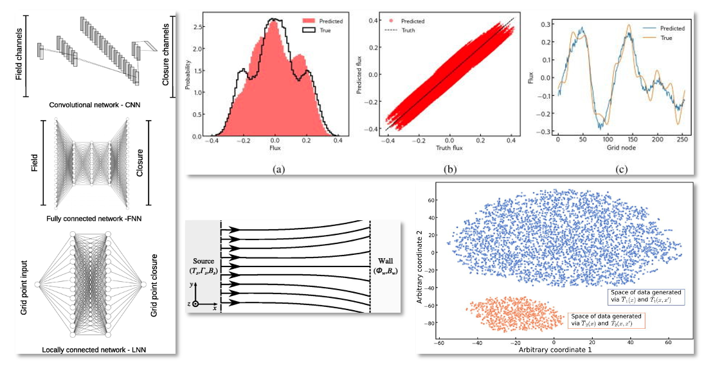
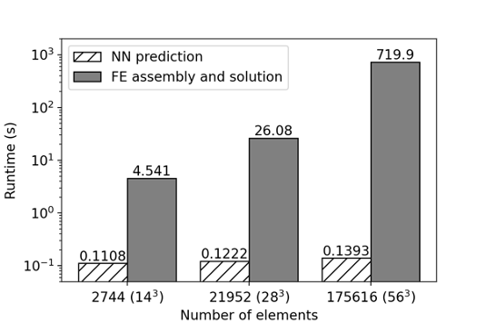
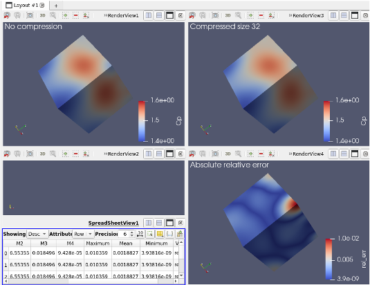
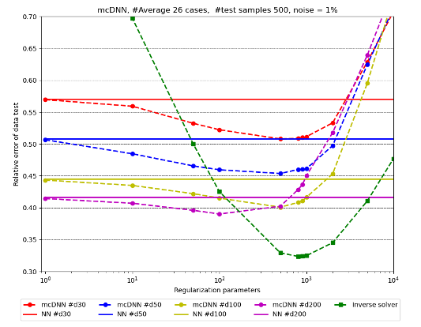

# TDS Machine Learning Efforts

## ML-based closure
Highlight by Romit Maulik (ANL), Nathan Garland (Griffith University, Australia), Josh Burby (LANL), Xian-Zhu Tang (LANL),
and Prasanna Balaprakash (ANL)

Analytic fluid closures are widely used for modelling magnetized plasmas. In this collaboration we explore how to apply deep learning methods to assess the capability of neural network architectures to reproduce crucial physics inherent in known magnetized plasma closures. We find encouraging results, indicating the applicability of neural networks to closure physics. We can assess and recommend appropriate network architectures for the given non-locality properties dictated by the underlying physics of the plasma.

Paper [R. Maulik,  N. A. Garland,  J. W. Burby,  X.-Z. Tang, and  P. Balaprakash. Neural network representability of fully ionized plasma fluid model closures, Physics of Plasmas 27(7), 072106, 2020](https://doi.org/10.1063/5.0006457)

----

## Fast neural Poincaré maps for toroidal magnetic fields
Highlight by Josh Burby (LANL), Qi Tang (LANL), and Romit Maulik (ANL)

Poincaré maps for toroidal magnetic fields are routinely employed to study gross confinement properties in devices built to contain hot plasmas. In most practical applications, evaluating a Poincaré map requires numerical integration of a magnetic field line, a process that can be slow and that cannot be easily accelerated using parallel computations. We propose a novel neural network architecture, the HénonNet, and show that it is capable of accurately learning realistic Poincaré maps from observations of a conventional field-line-following algorithm. After training, such learned Poincaré maps evaluate much faster than the field-line integration method. Moreover, the HénonNet architecture exactly reproduces the primary physics constraint imposed on field-line Poincaré maps: flux preservation. This structure-preserving property is the consequence of each layer in a HénonNet being a symplectic map. We demonstrate empirically that a HénonNet can learn to mock the confinement properties of a large magnetic island by using coiled hyperbolic invariant manifolds to produce a sticky chaotic region at the desired island location. This suggests a novel approach to designing magnetic fields with good confinement properties that may be more flexible than ensuring confinement using KAM tori.

Paper [J. W. Burby, Q. Tang, and R. Maulik. Fast neural Poincaré maps for toroidal magnetic fields, Plasma Physics and Controlled Fusion, 63(2), 024001, 2020](https://doi.org/10.1088/1361-6587/abcbaa)

----
## Scientific Deep learning (DL) methods for forward and inverse problems
Highlight by Tan Bui-Thanh (UT Austin)

Several scientific machine learning methods are proposed and analyzed to accurately surrogate numerical simulations and inverse solutions.

*FE-NN speed up compared to FE solution of hyperelasticity problem*

*Traditional inverse solution (no compression) and a DL data-scalable inverse solution (compression) for 3D inverse elasticity problems*

*Model-constrained DL solutions (dashed read, blue, yellow and purple for various data sizes) versus naive DL solutions (solid), and traditional inverse solution (green dashed) for nonlinear elliptic inverse problems*

*ROM-DL accuracy and speed up for nonlinear inverse problems versus full, reduced, and naive (purely data-driven) methods for nonlinear elliptic inverse problems*

----

## Exploration of machine learning for reduced order models of resistive MHD
**SAND2022-3490 W. Approved for public release; distribution is unlimited.** 

We have also briefly explored a long short-term memory network-based approach that uses reduced order
model (ROM) and a neural net (DNN) learning process. The method is termed a LSTM-ROM method.
This technique employs a 2-stage process. In the first step a set of snapshots from the high-fidelity simulation
are used to compute an orthogonal POD basis, from this computation the coefficients of the optimal
projection into the ROM subspace can then be computed at each time step for the snapshots. In the second
step a DNN is trained to reproduce the time series for the coefficients and auxiliary QoIs such as the
growth rate data. From this LSTM-ROM an approximate evolution of the state variables and the QoIs can
be obtained. In our preliminary studies for the simple 2D resistive tearing mode, the POD analysis resulted
in 3 POD modes being selected for the reduced space. Representative run times for the PDE based
simulation for a 2D resistive MHD tearing mode [250 sec. on 72 cores], the LSTM-ROM offline computation [POD: 5 sec., NN training: 50 sec.],
and the online [NN ROM computation: 1 sec.] demonstrated significant savings in computational costs.
Our current view is that these methods, generalized to act as surrogate models over multidimensional
parameter spaces can be used as ROM for exploration of multifidelity UQ type methods. (It should be
noted that this preliminary work was carried out with the RAPIDS SciDAC institute.)

Proof-of-principle images for the reconstruction of the final time tearing mode solution with the DNN-ROM method for Lundquist number = 10^3.
The filled contours are for the velocity magnitude and then a line plot of the y-velocity along the x-axis.
These are images of the high fidelity VMS FE resistive MHD solution, and the DNN-ROM reconstuction that uses only 4 POD vectors in the reconstruction.
The images are for the final time step in the transient simulation.
The QoI reconstruction is also presented.
This initial study was incomplete and more work is require to show the promise of the proposed techniques.

    

        
        <em>High fidelity FEM solution</em>
    

    

        
        <em>DNN ROM solution</em>
    

    

    

        
        <em>Reconstruction of a QoI (Momentum Integral) for the DNN ROM simulation</em>
    

    

----

## Adaptive training for CR surrogates
Highlight by Nathan Garland (Griffith University, Australia), Romit Maulik (ANL), Qi Tang (LANL), Xian-Zhu Tang (LANL),
and Prasanna Balaprakash (ANL)

Reliable plasma transport modeling for magnetic confinement fusion depends on accurately resolving the ion charge state distribution and radiative power losses of the plasma. These quantities can be obtained from solutions of a collisional-radiative (CR) model at each time step within a plasma transport simulation. However, even compact, approximate CR models can be computationally onerous to evaluate, and in-situ evaluations of these models within a coupled plasma transport code can lead to a rigid bottleneck. A way to bypass this bottleneck is to deploy artificial neural network surrogates for rapid evaluations of the necessary plasma quantities. However, one issue with training an accurate artificial neural network surrogate is the reliance on a sufficiently large and representative data set for both training and validation, which can be time-consuming to generate. In this study we further explore a data-driven active learning and training scheme to allow autonomous adaptive sampling of the problem parameter space that ensures a sufficiently large and meaningful set of training data assembled for the surrogate training. Our numerical experiments show that in order to produce a comparably accurate CR surrogate, the proposed approach requires a total number of data samples that is an order-of-magnitude smaller than a conventional approach.

Paper [N. A. Garland, R. Maulik, Q. Tang,  X.-Z. Tang, and  P. Balaprakash. Efficient training of artificial neural network surrogates for a collisional-radiative model through adaptive parameter space sampling, 2022](https://doi.org/10.48550/arXiv.2112.05325)

----

